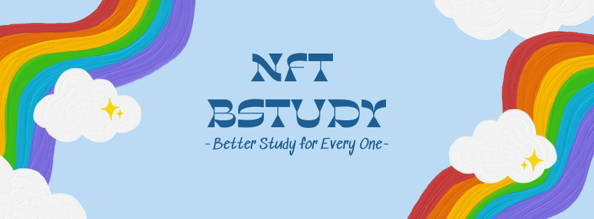
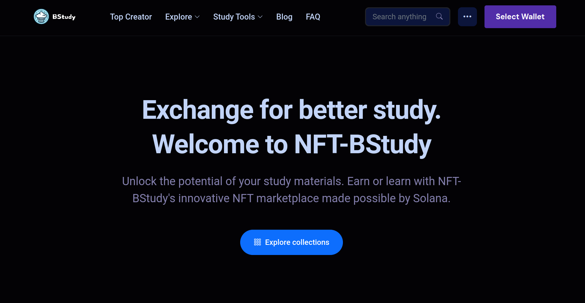
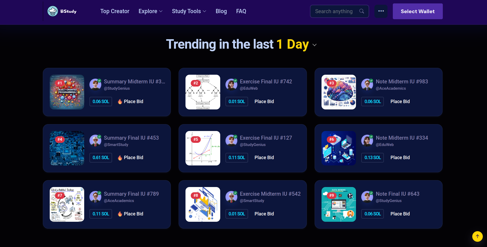
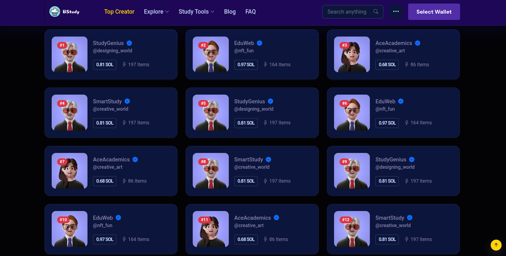
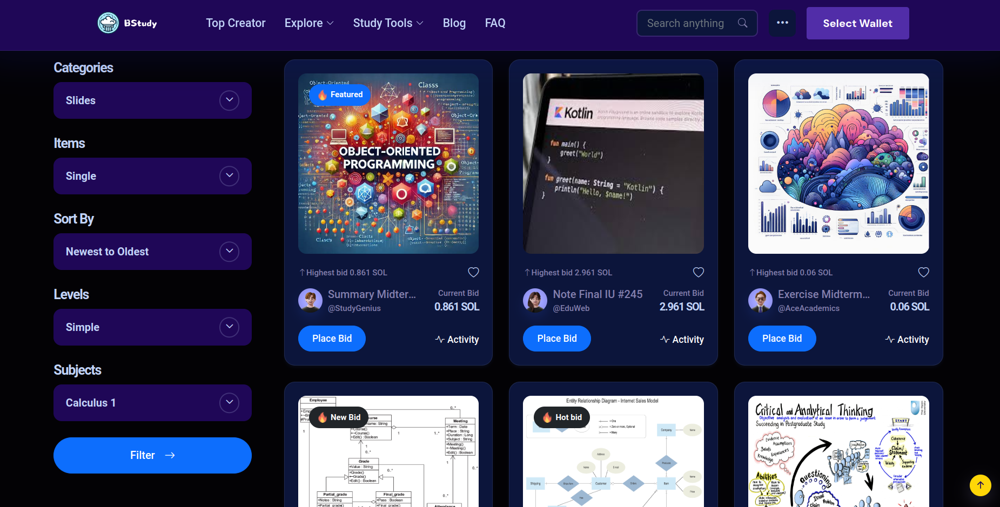
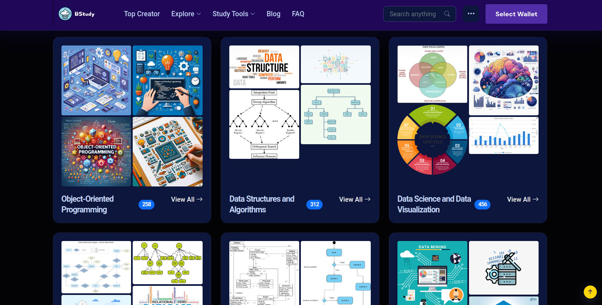

<div id="top" align="center">



</div>
<!-- PROJECT LOGO -->
<div align="center">
<h1 align="center">5LOOP TEAM</h1>
  <h3 align="center">
    NFT Marketplace Prototype for Solana Consumer Hack 16
    <br />
    <br />
    <a href="https://github.com/congbangitiu/NFT-BSTUDY-5LOOP-TEAM/issues">Report Bug</a>
    ·
    <a href="https://github.com/congbangitiu/NFT-BSTUDY-5LOOP-TEAM/issues">Request Feature</a>
  </h3>

[![Contributors][contributors-shield]][contributors-url]
[![Forks][forks-shield]][forks-url]
[![Issues][issues-shield]][issues-url]

</div>

<!-- About -->

# ABOUT

## 1. The team behind it

| No. |       Full Name       | Student's ID |              Email               |                          Github account                           |              Roles              | Contribution |
| :-: | :-------------------: | :----------: | :------------------------------: | :---------------------------------------------------------------: | :-----------------------------: | :----------: |
|  1  |   Nguyen Quang Dieu   | ITDSIU20031  | ITDSIU20031@student.hcmiu.edu.vn |            [itzmealvin](https://github.com/itzmealvin)            | **Founder** Front-end Engineer  |     20%      |
|  2  |  Nguyen Hoang Anh Tu  | ITDSIU20090  | ITDSIU20090@student.hcmiu.edu.vn |             [nghganhtu](https://github.com/nghganhtu)             | **Co-founder** Business Analyst |     20%      |
|  3  |      Vu Ngoc Anh      | BABAIU20016  | BABAIU20016@student.hcmiu.edu.vn | [Ngoc Anh Vu](https://www.linkedin.com/in/ngoc-anh-vu-75232315a/) |       Business Developer        |     20%      |
|  4  |     Dang Nhat Huy     | ITITIU20043  | ITITIU20043@student.hcmiu.edu.vn |           [Nhathuy1305](https://github.com/Nhathuy1305)           |       Interface Developer       |     20%      |
|  5  | Nguyen Luan Cong Bang | ITITIU20163  | ITITIU20163@student.hcmiu.edu.vn |          [congbangitiu](https://github.com/congbangitiu)          |       Front-end Engineer        |     20%      |

## 2. The project we are working on

**NFT-BStudy** is an innovative blockchain-based platform designed to facilitate the exchange of educational materials. Our mission is to create a fair and rewarding environment where content creators can monetize their work and users can access valuable resources.

## 3. Key Features

- []() **Upload and Earn:** Content creators can upload their study materials and receive compensation for their efforts.

- []() **Access and Pay:** Users can access a wide range of educational materials for a fee, ensuring that creators are fairly compensated.

- []() **Secure Transactions:** All transactions are secured through blockchain technology, providing transparency and security for both creators and users.

- []() **Platform Fees:** NFT-BStudy charges a small fee for each transaction to support the maintenance and development of the platform.

<!-- REASON -->

# REASON

## 1. Motivation

The traditional methods of exchanging educational materials often lack fairness and transparency. Content creators do not always receive adequate compensation for their efforts, and users face challenges in accessing quality resources. NFT-BStudy aims to address these issues by leveraging blockchain technology to create a decentralized platform that ensures fair compensation for creators and secure access for users. Our motivation is to build a community-driven platform that enhances the value of educational materials and promotes a culture of knowledge sharing.

## 2. Idea

NFT-BStudy is a blockchain-based platform that enables the exchange of educational materials in the form of NFTs (Non-Fungible Tokens). Content creators can upload their study materials, which are then tokenized as NFTs, allowing them to retain ownership and earn revenue each time their material is accessed. Users can browse and purchase these NFTs, ensuring that creators are compensated for their work. The platform charges a small transaction fee to support its operations and continuous development. By using blockchain technology, we ensure that all transactions are transparent, secure, and immutable, fostering trust among users and creators.

## 3. Roadmap

**Phase 1:** Conceptualization and Planning

- Define the platform's vision and mission.
- Conduct market research and feasibility studies.
- Develop the initial project plan and roadmap.

**Phase 2:** Development and Testing

- Design the platform architecture and user interface.
- Develop the core functionalities, including NFT creation, transaction processing, and user management.
- Integrate blockchain technology for secure and transparent transactions.
- Conduct thorough testing to ensure platform stability and security.

**Phase 3:** Launch and User Acquisition

- Launch the beta version of the platform for initial users and feedback.
- Implement marketing strategies to attract content creators and users.
- Establish partnerships with educational institutions and content creators.

**Phase 4:** Continuous Improvement and Expansion

- Gather user feedback and continuously improve the platform.
- Introduce new features and functionalities based on user needs and technological advancements.
- Expand the platform's reach by targeting new markets and user segments.
- Foster a community of users and creators through engagement and support initiatives.

**Phase 5:** Long-term Sustainability

- Ensure the platform's financial sustainability through strategic monetization models.
- Maintain a high standard of security and user experience.
- Continue to innovate and adapt to the evolving needs of the education and blockchain sectors.

Please see the [open issues](https://github.com/congbangitiu/NFT-BSTUDY-5LOOP-TEAM) for a full list of proposed features (
and known issues).

<!-- INSTALLATION -->

# INSTALLATION

### Required software

- pnpm
- ReactJs
- NodeJs

### Steps

1. Clone the repo
   ```sh
   git clone https://github.com/Nhathuy1305/Hackathon-5LOOP-TEAM
   ```
2. Open in Visual Studio Code IDE
3. Open terminal and run the command below

   ```sh
    npm i -g pnpm
    pnpm i --strict-peer-dependencies
    pnpm start
   ```

<!-- DEMO RESULT -->

# DEMO - RESULT

**Dashboard:** The Dashboard page of NFT-BStudy welcomes users with a clear message and slogan, "Exchange for better study." It provides easy access to explore study material collections, connect a digital wallet, and navigate through key sections of the platform.

<div align="center">

</div>

<br/>

**Popular NFTs:** The "Popular NFTs" section on the Dashboard page of NFT-BStudy showcases the most popular study materials based on recent activity. Users can view various items, see their current bid prices in SOL, and place bids directly on the displayed study materials.

<div align="center">

</div>

<br/>

**Top Creators:** The "Top Creators" page on NFT-BStudy highlights the leading contributors to the platform, showcasing their profiles, SOL earnings, and the number of items they have created. Users can view detailed information about each top creator and their contributions to the NFT marketplace.

<div align="center">

</div>

<br/>

**All NFTs Pass:** The "All NFTs Pass" page on NFT-BStudy allows users to browse and filter study materials by categories, items, sort order, levels, and subjects. Users can view detailed information, place bids, and participate in the exchange of various study materials presented as NFTs.

<div align="center">

</div>

<br/>

**Course Collections:** The "Course Collections" page on NFT-BStudy showcases various study materials organized by courses such as Object-Oriented Programming, Data Structures and Algorithms, and Data Science and Data Visualization. Each course collection displays a thumbnail, the total number of items available, and a "View All" link to explore the full collection.

<div align="center">

</div>

<br/>

**(and more screenshots hidden for you to explore yourself in our application...)**

<!-- CONTRIBUTING -->

<!-- CONTACT-->

# CONTACT

BStudy Official by **[Email HERE](mailto:betterstudy.official@gmail.com)**

Project Link: [https://github.com/Nhathuy1305/Hackathon-5LOOP-TEAM](https://github.com/Nhathuy1305/Hackathon-5LOOP-TEAM)

<!-- MARKDOWN LINKS & IMAGES -->

[contributors-shield]: https://img.shields.io/github/contributors/congbangitiu/NFT-BSTUDY-5LOOP-TEAM.svg?style=for-the-badge
[contributors-url]: https://github.com/congbangitiu/NFT-BSTUDY-5LOOP-TEAM/graphs/contributors
[forks-shield]: https://img.shields.io/github/forks/congbangitiu/NFT-BSTUDY-5LOOP-TEAM.svg?style=for-the-badge
[forks-url]: https://github.com/congbangitiu/NFT-BSTUDY-5LOOP-TEAM/network/members
[issues-shield]: https://img.shields.io/github/issues/congbangitiu/NFT-BSTUDY-5LOOP-TEAM.svg?style=for-the-badge
[issues-url]: https://github.com/congbangitiu/NFT-BSTUDY-5LOOP-TEAM/issues
